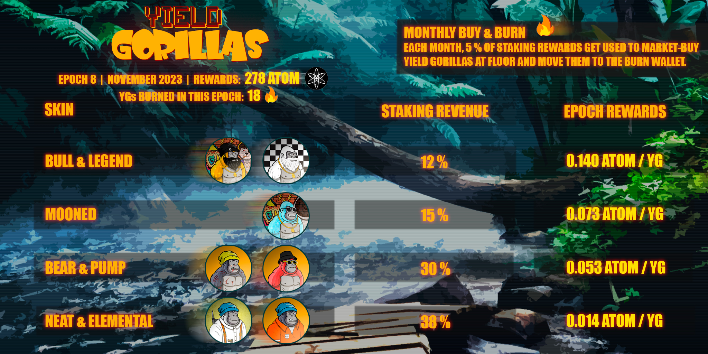
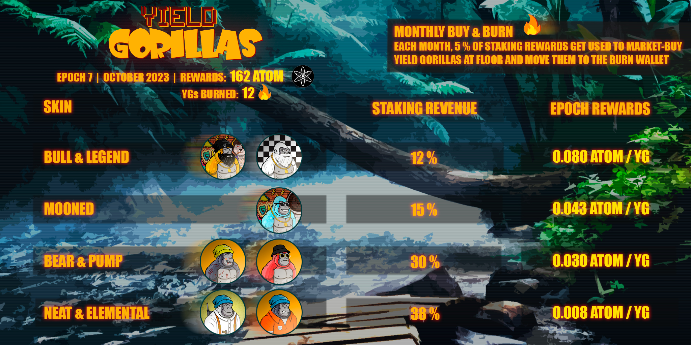
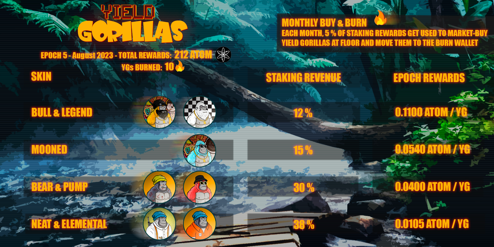
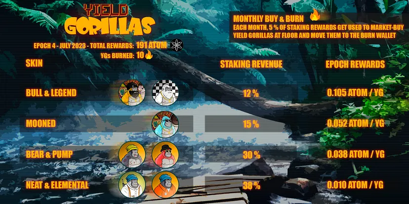
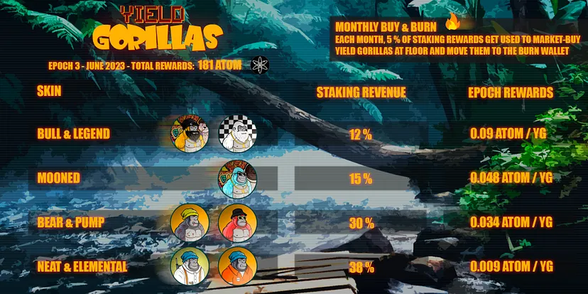

# YGs Reward Distribution

## YG Epoch 11

1st February 2024


YG Epoch 11


<figure><figcaption></figcaption></figure>

## YG Epoch 10

1st January 2024



<figure><figcaption></figcaption></figure>

## YG Epoch 9

1st December 2023



<figure><figcaption></figcaption></figure>

## YG Epoch 8

15th, November 2023



<figure><figcaption>
YG Epoch 8
</figcaption></figure>

## YG Epoch 7

3rd October 2023


YG Epoch 7


<figure><figcaption></figcaption></figure>

## YG Epoch 6

1st September 2023



<figure><figcaption>
YG Epoch 6
</figcaption></figure>

## YG Epoch 5

3rd August 2023


Epoch distribution&#x20;


<figure><figcaption>
Epoch 5
</figcaption></figure>

## YG Epoch 4

5th July 2023



<figure><figcaption>
YG 4th Epoch
</figcaption></figure>

## YG Epoch 3

31st May 2023



<figure><figcaption>
YG 3rd epoch
</figcaption></figure>

## YG Epoch 2

30th, April 2023



<figure><figcaption>
YG 2nd epoch
</figcaption></figure>

## YG Epoch 1

31st, March 2023



<figure><figcaption>
YG 1st epoch
</figcaption></figure>
