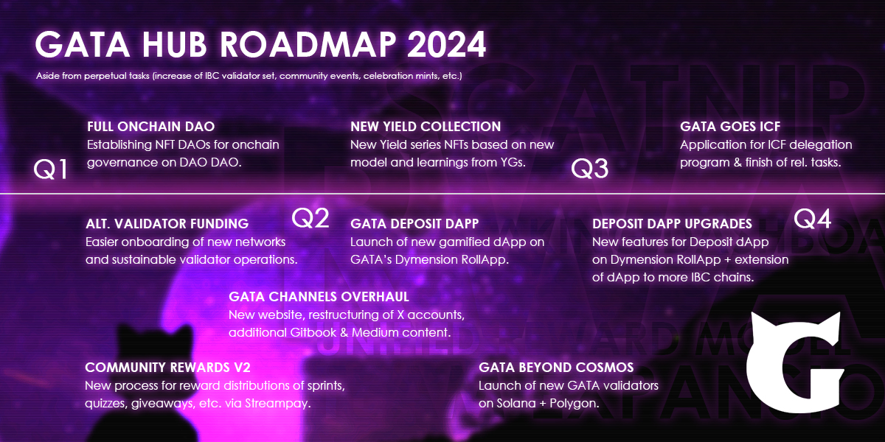

# Participation in Cosmos Governance

Cosmos is not just a blockchain; it's a decentralized network of interconnected blockchains. And its governance is a crucial aspect that empowers users to have a say in the evolution of the ecosystem. In this tutorial, we'll explore how to participate in Cosmos governance, why it's important, and the benefits it offers to both token holders and the overall Cosmos network.

**Understanding Cosmos Governance:** Learn the basics of Cosmos governance, including how proposals work, the role of validators, and the decision-making process. You can read about the cosmos governance [here](cosmos-governance.md)&#x20;

&#x20;**Acquiring ATOM Tokens:** To participate in governance, you'll need ATOM tokens. You can lern here [How to stake your Assets ](../creating-and-securing-your-cosmos-wallet/staking-your-asset-via-keplr-wallet.md)

**Setting Up Your Wallet:** Choose a compatible Cosmos wallet, such as Keplr or Leap, and set it up securely. You can read our step by step guide on how to install [Keplr](../creating-and-securing-your-cosmos-wallet/keplr.md) or [Leap wallet.](../creating-and-securing-your-cosmos-wallet/leap.md)&#x20;

**Accessing Governance Proposals:** Access the governance tab in your wallet to view active proposals and their details. To take part in the governance proposals you can either vote through [Keplr Wallet governance](https://wallet.keplr.app/?tab=active-proposals) or Leap Wallet governance by navigating to governace tab in the leap wallet.&#x20;

<figure><figcaption></figcaption></figure>

**Evaluating Proposals:** Understand how to assess proposals based on their impact, benefits, and potential risks to the network. To further explore the topic you can visit the discussion or take part in it on the [https://forum.cosmos.network/](https://forum.cosmos.network/)

**Casting Your Vote:** Learn how to cast your vote for or against proposals. Understand the importance of participation in shaping the network's future. Remember it is your sole choice to vote against or for the proposal. Act responsibly. &#x20;


By default delegators inherent the validator vote,  but you can always override the vote.


**Participating in Discussions:** Engage in community discussions on platforms like the Cosmos Forum and Discord to gain insights and contribute to informed decision-making.

**Benefits of Governance Participation:** Explore the advantages of participating in Cosmos governance, such as earning rewards, supporting network security, and influencing network upgrades.

**Risks and Considerations:** Be aware of potential risks, including slashing, and understand the responsibilities that come with voting.

**Staking for Governance:** - Discover how you can delegate your ATOM tokens to validators who support your governance preferences, combining staking with active participation. You can[ read our tutorial here ](../creating-and-securing-your-cosmos-wallet/staking-your-asset-via-keplr-wallet.md)

Participating in Cosmos governance is not just an opportunity to earn rewards; it's a chance to actively shape the future of a thriving blockchain ecosystem. By following this guide, you can make informed decisions, contribute to network improvements, and enjoy the benefits of being an engaged member of the Cosmos community. Your voice matters, so use it wisely to help Cosmos achieve its full potential.
