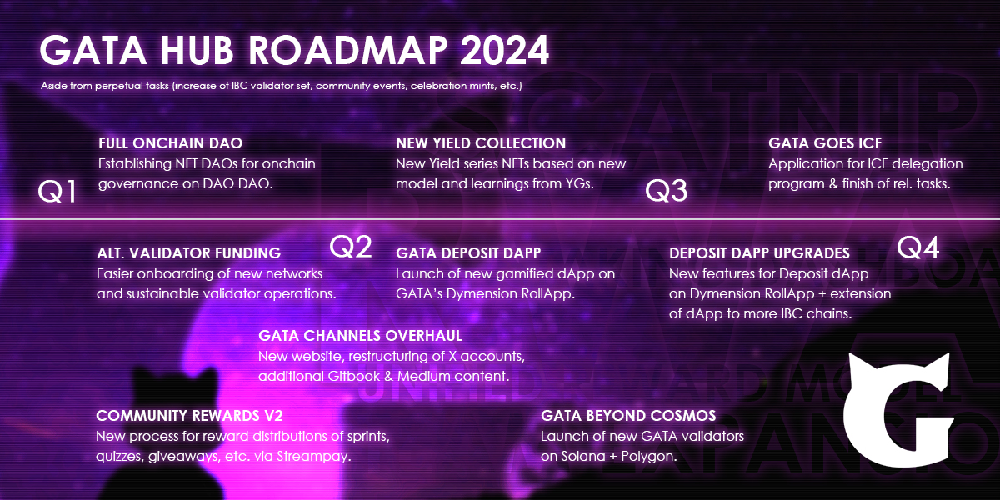

# Chose your validators wisely

Choosing the right validators is a fundamental aspect of IBC chains like Cosmos. Validators play a central role and your choice affects network security, your Staking Rewards, and more. In this guide, you'll learn how to choose your validators wisely.

### **Brush up on the Basics**

Before choosing a validator, make sure you have a solid understanding of the blockchain network you want to stake on. Be familiar with its consensus mechanism, the particular governance model, and the specific role of validators in the network. Helpful guides:

* [What is the Interchain?](../../what-is-the-interchain/) &#x20;
* [What is Cosmos Governance?](cosmos-governance.md)
* [How to Stake your Assets?](../creating-and-securing-your-cosmos-wallet/staking-your-assets-via-keplr-wallet.md)

### **Doing Validator Research**

Start digging into the data of validators on explorers like [Mintscan](https://www.mintscan.io/visualization/validators). Validators are ranked by performance and reputation and it pays to check the performance of validators.&#x20;



#### **Reputation and Track Record**

Reputation matters - validators with a strong track record of reliability, transparency, and community engagement are often more trustworthy. Look for validators with a history of successful community participation.

#### **Dive into Performance Metrics of Validators**

Validator performance metrics include uptime, commissions, and historical performance. Validators with high uptime and competitive commissions are generally more attractive. Tools such as the [Ping Dashboard](https://ping.pub/cosmos/uptime) are useful for analyzing these metrics.



<figure><figcaption></figcaption></figure>

#### **Security Practices**

Validators must prioritize network security. Finding out information about their security practices, such as DDoS protection, hardware redundancy, and key management, is advisable. Secure validators are critical to the security of the Cosmos network.

#### **Community Involvement & Communication**

Validators who actively engage with the community often have a deeper understanding of network dynamics. Look for validators who contribute to discussions, provide educational content, or support network upgrades.

Validators should maintain open communication channels with their delegators. Check if they have active social media profiles, chat groups in Discord or Telegram, or official websites where they share updates & insights and respond to your queries in proper time.


Delegate to those validator who responds to your queries in proper time.&#x20;


### **Review Delegation Terms**

Review the delegation terms of validators. Some may offer additional rewards or incentives. Ensure you understand their terms and conditions before delegating.

### **Test with Small Delegations**

If you're uncertain about a validator, consider delegating a small amount initially to test their performance and reliability. If they meet your expectations, you can increase your delegation later.

### **Stay Informed about Validators**

Stay updated on network changes and validator performance. Validators' circumstances can change over time, so periodic assessment is essential.

### **Monitor Your Delegations**

Regularly check the performance of your validators. There are tools and platforms like that provide real-time data on validator performance, helping you make informed decisions.

### Your Impact

Your choice of validators contributes to both the safety and success of the Cosmos ecosystem. Make well-informed decisions that benefit both you and Cosmos.

German/Deutsch - Weise Validatorenwahl

### Leitfaden zur Auswahl von Validatoren

Die Wahl der richtigen Validatoren ist ein grundlegender Aspekt von PoS-Blockchain-Netzwerken wie Cosmos. Validatoren spielen eine zentrale Rolle. Ihre Wahl beeinflusst die Sicherheit des Netzwerks, deine Staking Rewards und vieles mehr. In diesem Leitfaden erfährst du, wie du Validatoren klug auswählst.

### **Grundlagen auffrischen**

Bevor du dich für einen Validator entscheidest, solltest du sicherstellen, dass du ein solides Verständnis des Blockchain-Netzwerks hast, in dem du staken möchtest.

Sei vertraut mit dessen Konsensmechanismus, dem jeweiligem Governance-Modell und der spezifischen Rolle der Validatoren im Netzwerk.&#x20;

Hilfreiche Leitfäden:

* [What is the Interchain?](../../what-is-the-interchain/) &#x20;
* [How to Stake your Assets?](../creating-and-securing-your-cosmos-wallet/staking-your-assets-via-keplr-wallet.md)
* [What is Cosmos Governance?](cosmos-governance.md)

Um mit der Validatorensuche zu beginnen, sind sowohl die offiziellen Websites des jeweiligen IBC-Projekts als auch Explorer wie [Mintscan](https://www.mintscan.io/visualization/validators) exzellente Startpunkte.&#x20;

Es zahlt sich aus, die Leistung der Validierer zu überprüfen. Die Validatoren werden in der Regel nach Leistung und Ruf eingestuft.&#x20;

#### Reputation und **Track Record prüfen**

Zugleich is Reputation wichtig: Validatoren mit einer starken Erfolgsbilanz in Bezug auf Ihre Zuverlässigkeit, Transparenz und Community-Engagement sind oft vertrauenswürdiger einzustufen.&#x20;

#### **Performancemetriken der Validatoren sichten**

Zu den Leistungskennzahlen der Validatoren zählen Uptime, Commissions und die historische Performance. Validatoren mit hoher Uptime und wettbewerbsfähigen Commissions sind im Allgemeinen attraktiver. Tools wie das [Ping Dashboard](https://ping.pub/cosmos/uptime) sind nützlich, um diese Kennzahlen zu analysieren.

#### Sicherheitspraktiken

Validatoren müssen der Netzwerksicherheit Vorrang einräumen. Informationen zu ihren Sicherheitspraktiken herauszufinden, wie z.B. DDoS-Schutz, Hardware-Redundanz und Schlüsselverwaltung, ist ratsam. Sichere Validatoren sind entscheidend für die Sicherheit des Cosmos Netzwerks.

#### Engagement in der Community & Kommunikation

Sich aktiv beteiligende Validatoren haben oft ein besseres Verständnis für die Dynamik des Netzwerks. Begibg dich auf die Suche nach Validatoren, die zu Diskussionen beitragen, Bildungsinhalte bereitstellen oder Netzwerk-Upgrades unterstützen.&#x20;

Validatoren sollten zugleich offene Kommunikationskanäle mit ihren Delegatoren unterhalten: Achte auf aktive Social-Media-Profile, Chat-Gruppen in Discord oder Telegram oder offizielle Websites. Nutze erste Anlaufpunkte, um Neues zu erfahren und dich mit anderen auszutauschen.

#### Delegationsbedingungen überprüfen

Überprüfe die Delegierungsbedingungen der Validatoren. Einige bieten zusätzliche Belohnungen oder Anreize. Vergewissere dich jedoch stets, dass du etwaige Bedingungen von diesen verstanden hast, bevor du delegierst.

### **T**est mit kleinen Delegationen

Falls du dir bei einem Validator unsicher sein soltest, empfiehlt es sich, zunächst einen kleinen Betrag zu delegieren, um dessen Leistung und Zuverlässigkeit zu testen.&#x20;

Wenn der Validtor deine Erwartungen erfüllt, kannst du Delegationen jederzeit erhöhen.

### Validator im Auge behalten

Halte dich regelmäßig über die Leistung der Validatoren auf dem Laufenden. Die Situation der Validatoren kann sich im Laufe der Zeit ändern, daher ist eine regelmäßige Bewertung wichtig. Es gibt Tools und Plattformen, die Echtzeitdaten über die Leistung von Validatoren liefern und dirn helfen, fundierte Entscheidungen zu treffen.

### Dein Impact

Deine Wahl der Validatoren trägt sowohl zur Sicherheit als auch zum Erfolg des Cosmos-Ökosystems bei. Triff gut fundierte Entscheidungen, die sowohl dir als auch Cosmos zugute kommen.

