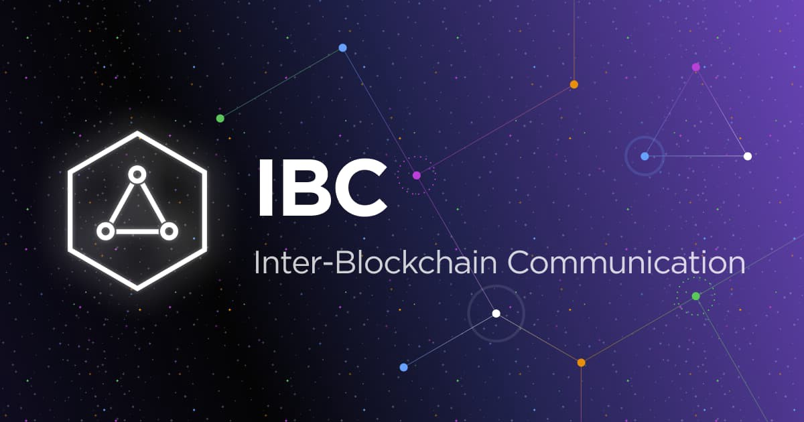

# Interoperability

**Interoperability in Cosmos: Bridging the Gap in Blockchain**

Blockchain technology, with its revolutionary potential, has transformed various industries and introduced the concept of decentralization. Yet, in the midst of this paradigm shift, a significant challenge looms - interoperability. In the cosmos of blockchain networks, the need for seamless communication between different blockchains has become paramount. Cosmos, with its innovative approach, is addressing this challenge head-on, setting the stage for the next phase of blockchain evolution.

<figure><figcaption></figcaption></figure>

**Understanding Interoperability**

Interoperability in the context of blockchain is the ability of distinct blockchain networks to communicate and transact with one another. Much like how the internet connects computers and enables the exchange of information globally, blockchain interoperability connects various blockchains, allowing them to share data and execute transactions. It's a vital component in creating a truly decentralized and interconnected digital ecosystem.

**The Cosmos Vision**

Cosmos, often referred to as the "Internet of Blockchains," introduces an innovative solution to the interoperability challenge. The Cosmos ecosystem is founded on the idea of an interconnected network of sovereign and scalable blockchains that can communicate with each other via the Inter-Blockchain Communication (IBC) protocol. This protocol enables secure and efficient communication between different chains within the Cosmos ecosystem, ensuring that they can operate as a unified whole.

**IBC: The Bridge Builder**

At the heart of Cosmos' interoperability solution is the IBC protocol. It acts as the bridge between independent blockchains, allowing them to pass messages and assets seamlessly. This approach differs significantly from traditional bridging solutions, where one blockchain is made subordinate to another, potentially leading to centralization. With IBC, every blockchain maintains its autonomy while participating in cross-chain transactions, assuring security and decentralization.

**Use Cases and Real-World Impact**

The implications of Cosmos' approach to interoperability are far-reaching. This technology enables use cases like decentralized finance (DeFi) to thrive across different blockchains. For instance, assets can move freely from one chain to another, allowing liquidity to flow across the entire network. Cosmos also paves the way for cross-chain smart contracts, cross-chain voting, and decentralized applications (dApps) that operate seamlessly across multiple chains.

**A Bright Future Ahead**

Cosmos is not only setting a new standard for interoperability within its ecosystem but also serving as an example for the broader blockchain space. As more blockchains adopt and integrate IBC, the potential for a truly interconnected blockchain universe becomes increasingly tangible.

In conclusion, interoperability is the missing puzzle piece that can unlock the full potential of blockchain technology. Cosmos, with its innovative IBC protocol, is leading the charge in making this vision a reality. As the Cosmos ecosystem continues to expand and more blockchains connect to its network, we're witnessing the birth of a new era in blockchain - one where the power of decentralization is fully harnessed, and where the cosmos of blockchains operates as an integrated, secure, and autonomous whole.\
\
**Read more here**&#x20;

* [Cosmos Network](https://cosmos.network/): The official website provides comprehensive information about Cosmos, its vision, and its components.
* [Cosmos Whitepaper](https://cosmos.network/resources/whitepaper): The original whitepaper outlines the vision and technical aspects of the Cosmos network.
* [IBC Protocol Specification](https://github.com/cosmos/ibc): For a technical deep dive into how IBC works, the protocol's GitHub repository offers detailed specifications.
* [Cosmos Blog](https://blog.cosmos.network/): The official blog regularly publishes articles on various topics, including interoperability and the use of IBC.
