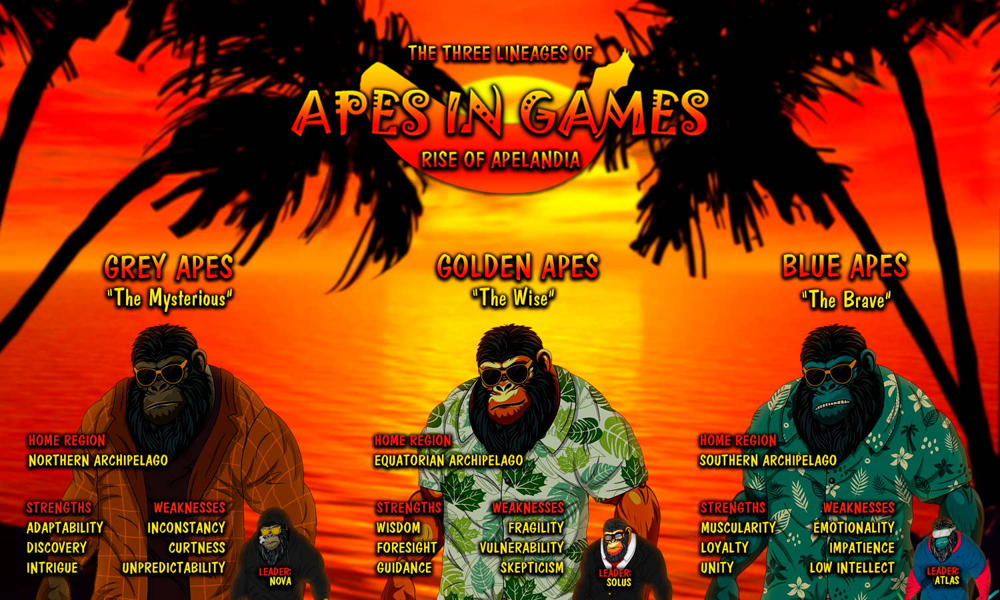

# The Lore

### Apes in Games - Rise of Apelandia

* Northern Archipelago: coldest regions of Apelandia, the only archipelago with actual ice on Apelandia, home of the [Grey Apes](the-lore.md#nova-and-the-grey-apes-jupiters-fury)
* Equatorial Archipelago: tropical islands filled with jungles and all kinds of creatures & resources, home of the [Golden Apes](the-lore.md#solus-and-golden-apes-dirty-martian-dust)
* Southern Archipelago: biggest mining region of Apelandia with valuable minerals, home of the [Blue Apes](the-lore.md#atlas-and-blue-apes-amazonian-jungle-fever)

Nova &#x26; the Grey Apes - “Jupiter’s Fury”

In the **Northern Archipelago,** the Grey Apes thrived amidst ice-capped mountains and sprawling tundras. The harsh conditions forged their adaptability and curiosity, yet their unpredictable environment engrained itself in the Grey Apes’ spirit. Led by their leader **Nova**, they excel in discovery, though sometimes struggle with consistency.

On the towering plateau of the **Obsidian Ice Plate**, the Grey Apes discovered a mysterious portal leading to **Jupiter**. Stepping through the light, they faced Jupiter's tempests. Harnessing their technological prowess and skills, they tamed the gas giant's chaos quickly, unveiling the mysteries of the ancient biodomes that glittered in the dark around Jupiter.

However, their cosmic explorations got disrupted by the **X Corporation**. Driven by reckless ambitions, the corporate leviathan's **deep-space miners** descended on Jupiter's moons like voracious locusts, heedless of ecological balance.

Recognizing the impending danger, Nova rallied the Grey Apes for a daring mission to place a treacherous **self-replicating minefield** in Jupiter's outer orbit. As X Corps massive mining fleet neared Jupiter, **Nova's strategic brilliance** and his tribe's **technological prowess** melded into a symphony of defense. The ensuing clash was a dance of pulsating energy beams and cunning maneuvers, illuminated against the backdrop of Jupiter's ferocious storms.

The Grey Apes' unwavering determination bore fruit, thwarting X Corps plundering aspirations. But amidst victory, a grim reality emerged like a dark specter, as **X had learned about Apelandia.** \
\
Haunted by the loss of captured kin and the looming threat of X Corps voracity, t**he Grey Apes returned through the portal**, resolved to safeguard their home from the approaching tempest of corporate exploitation.

Atlas &#x26; Blue Apes - “Amazonian Jungle Fever”

In the thick jungles and azure waters of the **Southern Archipelago**, generations of hunters and miners turned the Blue Apes into the most muscular Apes of Apelandia. Yet, their impatience and emotional outbursts are as challenging as their oftentimes limited intellect. Led by their leader **Atlas**, their courage shines, though tempered by occasional recklessness.

At the center of the thick jungles of the Blue Apes’ archipelago lies the **Endless Hole**, considered to be the oldest mining facility on **Apelandia.** There had been stories about mysterious phenomena in the depths of this landmark for ages already, so the Blue Apes were not surprised when an actual portal to the stars appeared in one of its lowest shafts.

Atlas assembled a crew to venture forth, ready to face the unknown. The portal led them straight to the far-away **Earth** into the vast jungles of the Amazon. It felt almost like home - the vegetation as dense as rich, so strange, yet familiar.

It didn’t take long till the Blue Apes discovered that the Amazon had its own boundaries, not set by nature, but by corporate greed though. They witnessed how **X Corporation’s pioneer squads** burned down hills full of trees and wildlife with huge **flamethrower tanks.** Neither Atlas nor his Blue Apes had ever witnessed such environmental devastation before. Filled with anger, they decided to take a stand.

Utilizing their **incredible strength & strategic minds** to strike at the heart of X Corps in the Amazon, the Apes started a fierce battle. Ripping apart the pioneer’s of the corporate world.

Their following victory celebration between burned-out tanks didn’t last long though, as the Apes were not aware that their actions triggered alerts in every military installation across South America and that **drone swarms** were already approaching their position.

\
No matter their strength & courage, the following napalm bombardment took its toll, forcing the **Blue Apes’ retreat to Apelandia** with the threat of X looming right behind them.

Solus &#x26; Golden Apes - “Dirty Martian Dust”

From the vibrant shores of the **Equatorian Archipelago**, the Golden Apes emerged and their lives intertwined with the tropical paradise surrounding them. Under the sun's embrace, they thrived, and their wisdom reflected in the lush landscapes of abundance around them. Guided by their wise leader **Solus**, the journey they were about to embark on seemed almost surreal.

Within the heart of the archipelago, a portal was discovered. The enigmatic **Black Lagoon**, a once tranquil oasis of reflection for the Golden Apes, transformed into a cosmic gateway to far-away **Mars**. As cautious as the Apes of Solus may be, they couldn’t contain the sparks of curiosity.

When the first brave souls of the Golden Apes stepped through the portal, they couldn’t believe their eyes. Nothing could have been more different to their home in Apelandia than the distant **Martian deserts**, which welcomed them with a reddish glow.&#x20;

Soon after their arrival, the Apes discovered an **ancient artifact** of a long lost civilization, unlocking the secrets of the cosmos. The artifact recognized Solus as guardian of knowledge and struck him with a data upload ray.&#x20;

Wondering about the sudden emergence of strange signals coming from the red planet, the crew of an **observation station** of X Corporation around Mars got curious and their orders were clear: X sought to harness ancient knowledge for their nefarious ambitions - at any & all costs.\

**Planetary landing pods** got launched, filled with heavily armed X Corp. mercenaries. Being made aware of the incoming drop ships by the ancient tech, Solus had to act quickly. He taught the other Golden Apes how to reactivate the few hidden **particle weapons** that were left after millenia of inactivity. Together they unleashed hell on the goons of X.\

Despite all odds and through their courage & wisdom, Solus and his crew managed to push back the mercenaries. The price of victory was high though, as many got killed & wounded. The Golden Apes had to return to Apelandia and Solus knew that X would be following soon - **a storm was brewing.**

## Strength and weaknesses&#x20;

<figure><figcaption></figcaption></figure>

## The Three Archipelagos

## **Northern Archipelago (Home of the Grey Apes)**

The Northern Archipelago, a realm of stark beauty, unfolds amidst ice-capped peaks and sprawling tundras. Harsh conditions sculpted the Grey Apes' adaptability and inquisitiveness, while the unpredictable environment became their defining backdrop.&#x20;

Unique in its dramatic contrasts, this land of extremes propelled the Grey Apes to master both discovery and the art of adapting swiftly to the ever-changing rhythms of nature.&#x20;

Amidst this awe-inspiring tableau stands the Obsidian Ice Plate, a sentinel and symbol of their resilience and the gateway to Jupiter.

**Equatorian Archipelago (Home of the Golden Apes)**

The Equatorian Archipelago is a tapestry of vibrant life, graced with tropical paradises and azure waters. Here, the Golden Apes find harmony amid the sun-dappled shores, their existence intertwined with abundant landscapes and tropical resources.&#x20;

Wisdom blossoms under the nurturing embrace of equatorial warmth, shaping the Golden Apes leadership and camaraderie. In this idyllic haven, the Black Lagoon shimmers as a sanctuary of introspection, reflecting their penchant for guidance and unity.&#x20;

Amidst this lush paradise, a portal to Mars beckons, ushering them from familiar splendor to the enigmatic cosmos.

## **Southern Archipelago (Home of the Blue Apes)**

The Southern Archipelago, a realm of untamed allure, sprawls with dense jungles, azure waters and cascading waterfalls. Here, the Blue Apes thrive, their muscular prowess and unity hewn from the challenges of this rugged paradise. Loyalty and unwavering courage define their essence, forged by a land that demands tenacity.&#x20;

At its heart lies the legendary Endless Hole, a testament to their industrious spirit and ancestral bonds. As a portal to Earth materialized, it propels the Apes from primal landscapes to an unforeseen cosmic destiny, where bravery melds with cosmic intrigue.

## The Three Landmarks

## **Obsidian Ice Plate (Landmark of the Northern Archipelago & Portal to Jupiter)**

The Obsidian Ice Plate, a towering sentinel of the Northern Archipelago, isn't just a geological oddity. It serves as a symbol for the Grey Apes' resilience, as - amidst its frigid expanse - they honed adaptability and tamed unpredictability.&#x20;

Standing for the Grey Apes’ tenacity and a testament to their ability to thrive in the harshest of conditions, this holy landmark encapsulates the very essence of their lineage's spirit.&#x20;

Neither Nova nor any other Grey Ape was surprised when the portal to Jupiter formed on this altar of unpredictability, leading them to their fate among the stars.

## **Black Lagoon (Landmark of the Equatorian Archipelago & Portal to Mars)**

The Black Lagoon, nestled within the Equatorian Archipelago, isn't just a picturesque waterbody. For the Golden Apes, it's a sanctuary of reflection and wisdom, where they've sought solace amid lush jungles. Its timeless serenity has nurtured the Golden Ape’s affinity for guidance and unity.&#x20;

Little did Solus and his band of wise apes know that this idyllic haven would be the portal to Mars, catapulting them from familiar shores into the depths of cosmic intrigue, forever intertwining their fate with the far-away red planet.

## **Endless Hole (Landmark of the Southern Archipelago & Portal to Earth)**

The Endless Hole, an ancient mining marvel within the Southern Archipelago, isn't merely a colossal excavation site. It's the bedrock of the Blue Apes' valor and unity, a testament to their unyielding strength.&#x20;

Generations of toil beneath its depths forged the Blue Apes muscular might and resilience, while its cavernous expanse echoed with tales of loyalty and camaraderie. As a bastion of their heritage, it's a natural epicenter for their determination.&#x20;

When the portal to Earth opened in one of the deepest shafts, Atlas and his brave warriors propelled from their familiar realm into a cosmic clash with huge repercussions for Apelandia.

\

